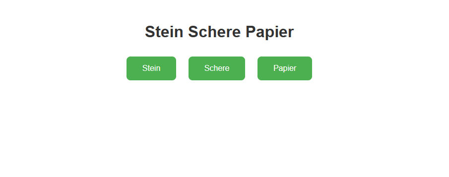
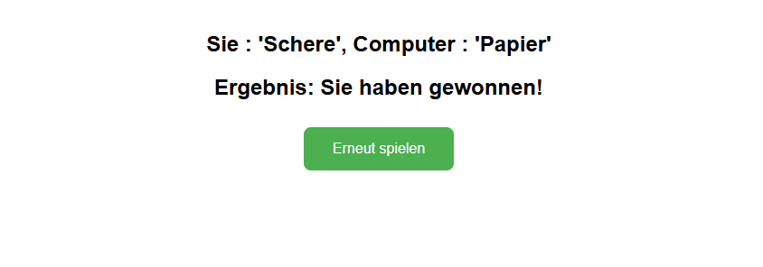
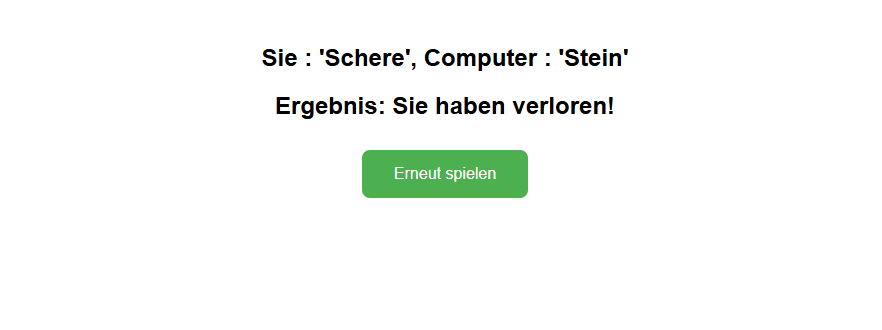
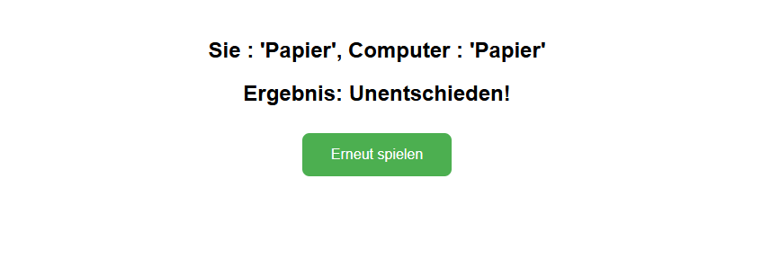

# Anwendung
Dies ist eine Web-Version des Spiels "Stein Schere Papier" als Spring Boor Programmierbeispiel. 

# Beschreibung
Nach dem Start des Programms hat der Benutzer über Buttons die Auswahl der 3 Spielelemente Stein, Schere oder Papier.

Der Computer als Kontrahent wählt ein zufälliges Spielelement.

# Spielregeln

- Spielelement "Stein" gewinnt gegen "Schere", verliert gegen "Papier"
- Spielelement "Schere" gewinnt gegen "Papier", verliert gegen "Stein"
- Spielelement "Papier" gewinnt gegen "Stein", verliert gegen "Schere"

- Wählen beide das gleiche Spielelement ist das Ergebnis "Unentschieden".

# Screenshots

## Hauptseite

## Spiel wurde gewonnen

## Spiel wurde verloren

## Spiel ist unentschieden ausgegsngen
